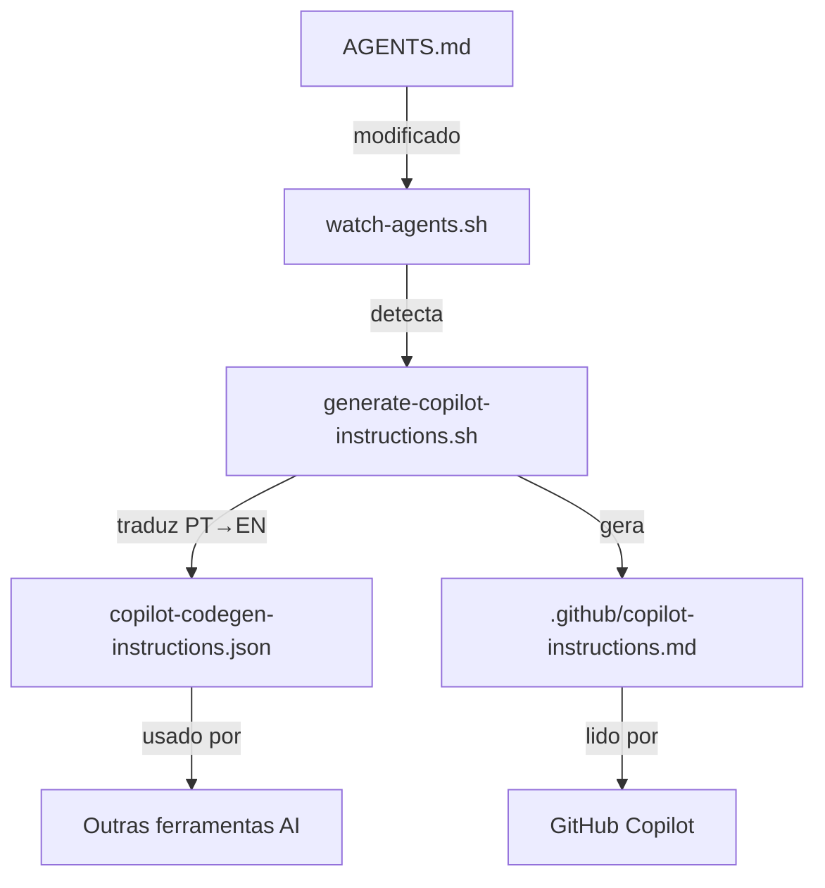

# GitHub Copilot — Custom Instructions (AI Powered Integration)

## 📖 Visão Geral

Este projeto fornece instruções customizadas ao GitHub Copilot automaticamente, garantindo que o assistente de IA integrado ao editor entenda e siga os padrões do projeto.

## 🎯 Objetivo

Fazer com que o GitHub Copilot:

✅ Conheça os padrões de código do projeto (AGENTS.md)
✅ Use nomenclatura correta (kebab-case, português para variáveis)
✅ Siga estrutura obrigatória de scripts (cabeçalho, logging, main)
✅ Aplique validações necessárias (shellcheck, BATS)
✅ Mantenha consistência em todo o código gerado

## 🚀 Como Funciona

### Arquitetura (overview)



### Arquivos Gerados

#### 1. `.github/copilot-instructions.md`

**Formato**: Markdown
**Uso**: GitHub Copilot nativo do VS Code
**Reconhecimento**: Automático quando o workspace é aberto

O GitHub Copilot **automaticamente** busca e lê arquivos em `.github/copilot-instructions.md` quando você abre um projeto no VS Code.

#### 2. `copilot-codegen-instructions.json`

**Formato**: JSON
**Uso**: Outras ferramentas (Aider, APIs, etc.)
**Reconhecimento**: Manual/configurável

Arquivo estruturado para integração com outras ferramentas de IA.

## ⚙️ Configuração do Devcontainer

### Configurações Adicionadas ao `devcontainer.json`

```json
{
  "customizations": {
    "vscode": {
      "settings": {
        // GitHub Copilot - Custom Instructions
        "github.copilot.advanced": {
          "debug.overrideEngine": "gpt-4",
          "debug.useNodeFetcher": true
        },
        "github.copilot.enable": {
          "*": true,
          "yaml": true,
          "plaintext": true,
          "markdown": true,
          "shellscript": true
        }
      }
    }
  }
}
```

**Benefícios:**

- ✅ Copilot habilitado para tipos de arquivo relevantes
- ✅ Engine compatível configurada no Dev Container
- ✅ Suporte explícito para shellscript, markdown e YAML

## 🔄 Processo de Atualização Automática

### Fluxo Completo

1. **Desenvolvedor edita `AGENTS.md`**
   - Adiciona novos padrões
   - Atualiza exemplos
   - Corrige diretrizes

2. **Watcher detecta mudança** (watch-agents.sh)
   - Monitoramento em tempo real via inotifywait
   - Debounce de 2 segundos

3. **Script de geração executa** (generate-copilot-instructions.sh)
   - Traduz conteúdo PT → EN
   - Gera `.github/copilot-instructions.md`
   - Gera `copilot-codegen-instructions.json`

4. **GitHub Copilot usa novas instruções**
   - Recarregamento automático no próximo uso
   - Sem necessidade de restart do VS Code

### Verificação

```bash
# Ver quando foi atualizado
ls -lh .github/copilot-instructions.md

# Ver conteúdo
head -30 .github/copilot-instructions.md

# Verificar JSON também
jq '.generated' copilot-codegen-instructions.json
```

## 📝 Como o Copilot Usa as Instruções

### Durante Code Completion

Quando você escreve código, o Copilot:

1. Lê `.github/copilot-instructions.md`
2. Entende o contexto do projeto
3. Aplica as regras definidas em AGENTS.md
4. Gera código consistente com os padrões

### Exemplo Prático

**Sem instruções customizadas:**

```bash
#!/bin/bash
# script.sh

function doSomething() {
  echo "doing something"
}

doSomething
```

**Com instruções customizadas:**

```bash
#!/bin/bash
################################################################################
# Script: do-something.sh
# Description: Executes a specific operation
################################################################################

# Carrega biblioteca comum
source "$(dirname "${BASH_SOURCE[0]}")/commons.sh"

do_something() {
  _log_func_enter "do_something"

  log_info "Executing operation"

  # Operation logic here

  _log_func_exit_ok "do_something"
  return 0
}

main() {
  _log_func_enter "main"

  do_something

  _log_func_exit_ok "main"
  exit 0
}

if [[ "${BASH_SOURCE[0]}" == "${0}" ]]; then
  main "$@"
fi
```

## 🧪 Testando a Integração

### Teste 1: Verificar Reconhecimento

1. Abra o VS Code no workspace
2. Pressione `Ctrl+Shift+P`
3. Digite "Copilot: Open Copilot"
4. No chat, pergunte: "What are the naming conventions for this project?"

**Resposta esperada:** Deve mencionar kebab-case, português para variáveis, etc.

### Teste 2: Gerar Código

1. Crie um novo arquivo: `test-script.sh`
2. Digite apenas: `#!/bin/bash`
3. Pressione `Enter` e aguarde sugestões do Copilot

**Resultado esperado:** Deve sugerir o cabeçalho completo com `# Script:` e `# Description:`

### Teste 3: Verificar Funções

1. Em um arquivo .sh, comece a escrever uma função:

   ```bash
   process_data() {
   ```

2. Aguarde sugestões

**Resultado esperado:** Deve sugerir `_log_func_enter "process_data"` como primeira linha

## 🎓 Melhores Práticas

### Para Desenvolvedores

#### ✅ DO

- Confie nas sugestões do Copilot para seguir padrões
- Use o Copilot Chat para perguntas sobre o projeto
- Revise o código gerado para garantir qualidade
- Atualize AGENTS.md quando novos padrões forem estabelecidos

#### ❌ DON'T

- Não edite `.github/copilot-instructions.md` manualmente
- Não ignore sugestões sem motivo válido
- Não desabilite o Copilot em arquivos `.sh`

### Para Manutenção

#### Atualizar Instruções

1. Edite `AGENTS.md` (sempre em português)
2. Salve o arquivo
3. Aguarde ~5 segundos (tradução + geração)
4. Verifique que arquivos foram atualizados:

   ```bash
   ls -lh .github/copilot-instructions.md
   ls -lh copilot-codegen-instructions.json
   ```

#### Validar Conteúdo

```bash
# Ver estatísticas
./generate-copilot-instructions.sh

# Ver logs do watcher
tail -f logs/watch-agents.log

# Verificar timestamp
jq '.generated' copilot-codegen-instructions.json
```

## 🔍 Troubleshooting

### Copilot não está seguindo as instruções

**Possíveis causas:**

1. Arquivo `.github/copilot-instructions.md` não existe
2. Conteúdo desatualizado
3. VS Code precisa ser recarregado

**Soluções:**

```bash
# 1. Verificar se arquivo existe
ls -lh .github/copilot-instructions.md

# 2. Regenerar manualmente
./generate-copilot-instructions.sh

# 3. Recarregar VS Code
# Ctrl+Shift+P → "Developer: Reload Window"

# 4. Verificar se watcher está rodando
./watch-agents.sh --status
```

### Instruções desatualizadas

**Sintoma:** Mudanças em AGENTS.md não refletem no Copilot

**Verificar:**

```bash
# Comparar timestamps
stat -c '%y' AGENTS.md
stat -c '%y' .github/copilot-instructions.md

# Se diferentes, regenerar
./generate-copilot-instructions.sh
```

### Copilot não carrega instruções

**Verificar configurações do VS Code:**

1. Abra Command Palette (`Ctrl+Shift+P`)
2. "Preferences: Open Settings (JSON)"
3. Verificar se tem:

   ```json
   {
     "github.copilot.enable": {
       "*": true
     }
   }
   ```

## 📊 Arquivos e Localizações

| Arquivo | Tipo | Propósito | Auto-gerado |
|---------|------|-----------|-------------|
| `AGENTS.md` | Fonte | Documentação em português | ❌ Manual |
| `.github/copilot-instructions.md` | Saída | Instruções do Copilot (EN) | ✅ Sim |
| `copilot-codegen-instructions.json` | Saída | Instruções estruturadas | ✅ Sim |
| `generate-copilot-instructions.sh` | Script | Gerador de instruções | ❌ Manual |
| `watch-agents.sh` | Script | Monitorador automático | ❌ Manual |

## 🔗 Referências

- [GitHub Copilot Documentation](https://docs.github.com/en/copilot)
- [Custom Instructions Guide](https://github.blog/2023-11-08-universe-2023-copilot-transforms-github-into-the-ai-powered-developer-platform/)
- Arquivo local: `AGENTS.md` - Padrões do projeto
- Arquivo local: `WATCHER.md` - Documentação do watcher

## ✨ Benefícios da Integração

### Produtividade

✅ **Código consistente**: Todos os scripts seguem o mesmo padrão
✅ **Menos revisões**: Código gerado já está correto
✅ **Onboarding rápido**: Novos desenvolvedores têm assistência contextualizada
✅ **Zero configuração**: Funciona automaticamente no devcontainer

### Qualidade

✅ **Padrões aplicados**: AGENTS.md sempre seguido
✅ **Validações automáticas**: Copilot sugere código que passa nos testes
✅ **Nomenclatura correta**: Português para variáveis, kebab-case para arquivos
✅ **Estrutura obrigatória**: Headers, logging, main function

### Manutenção

✅ **Centralizado**: AGENTS.md é a única fonte de verdade
✅ **Versionado**: Instruções fazem parte do Git
✅ **Auditável**: Logs completos de todas as regenerações
✅ **Automático**: Watcher mantém tudo sincronizado

---

**Implementado por:** GitHub Copilot AI Agent
**Data:** 2025-10-12
**Versão:** 1.0.0
**Status:** ✅ Produção
