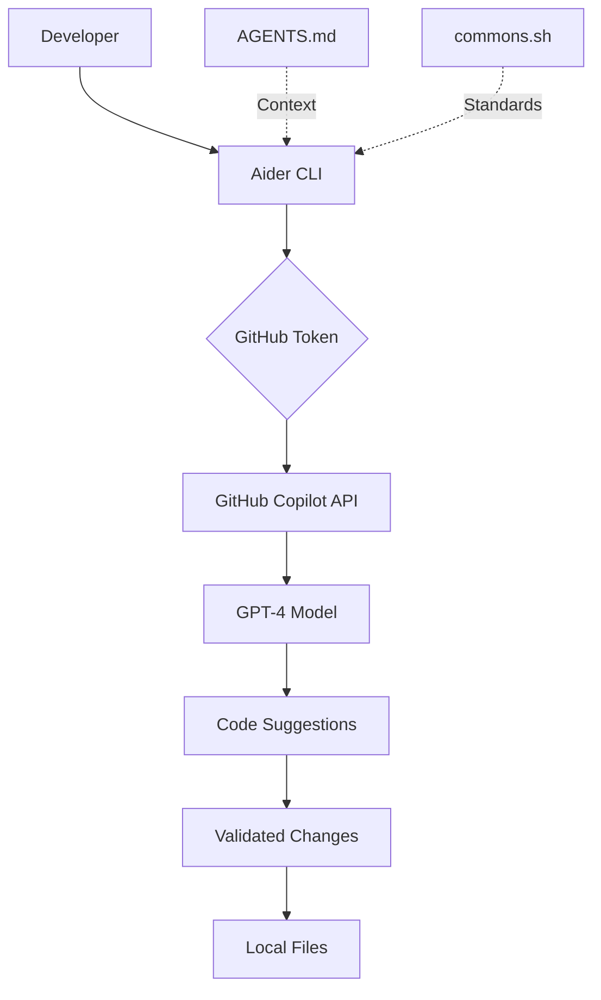

# 🎉 Aider AI Integration - Summary

## ✅ Successfully Completed

Your DevContainer has been updated with **Aider AI** integration using GitHub Copilot as the LLM backend.

## 📋 Changes Made

### 1. Configuration Files

#### ✏️ Modified: `.devcontainer/devcontainer.json`

Added environment variables:

```json
"containerEnv": {
  "OPENAI_API_BASE": "https://api.githubcopilot.com",
  "OPENAI_API_KEY": "${localEnv:GITHUB_TOKEN}",
  "AIDER_MODEL": "gpt-4",
  "AIDER_AUTO_COMMITS": "false",
  "AIDER_DARK_MODE": "true"
}
```

Added Python 3.11 feature for Aider support.

#### ✏️ Modified: `.devcontainer/post-create.sh`

- Automatic Aider installation via pip
- Environment validation
- Version checking

#### ✏️ Modified: `.gitignore`

Added Aider-specific patterns to ignore cache and history files.

#### ✏️ Modified: `README.md`

Added AI-Assisted Development section with links to documentation.

### 2. New Files Created

| File | Purpose |
|------|---------|
| `AIDER_SETUP.md` | Complete setup and usage guide (5000+ words) |
| `AIDER_QUICKSTART.md` | Quick reference for common tasks |
| `AIDER_INTEGRATION.md` | Technical integration summary |
| `validate-aider.sh` | Automated validation script |
| `.aider.conf.yml` | Aider configuration file |
| `SUMMARY_AIDER.md` | This file - implementation summary |

## 🚀 Next Steps

### 1. Rebuild DevContainer

**IMPORTANT:** You need to rebuild the DevContainer for changes to take effect.

```bash
# In VS Code:
Ctrl+Shift+P → "Dev Containers: Rebuild Container"
```

### 2. Set GitHub Token (if needed)

If not using `gh auth login`, set your GitHub token:

```bash
# Linux/macOS - Add to ~/.bashrc or ~/.zshrc
export GITHUB_TOKEN="your_github_token_here"

# Or use GitHub CLI (recommended)
gh auth login
```

### 3. Validate Installation

After rebuild:

```bash
./validate-aider.sh
```

### 4. Start Using Aider

```bash
# Basic usage
aider

# With project context
aider AGENTS.md commons.sh

# Create new script
aider AGENTS.md commons.sh
> Create a new script 'my-script.sh' following AGENTS.md standards
```

## 📚 Documentation Quick Links

- **Quick Start:** [AIDER_QUICKSTART.md](./AIDER_QUICKSTART.md)
- **Complete Guide:** [AIDER_SETUP.md](./AIDER_SETUP.md)
- **Integration Details:** [AIDER_INTEGRATION.md](./AIDER_INTEGRATION.md)
- **Project Standards:** [AGENTS.md](./AGENTS.md)

## 🔍 How It Works



## ✨ Features Available

### Code Generation

- ✅ Create new scripts following project standards
- ✅ Generate functions with proper logging
- ✅ Auto-add BATS tests
- ✅ Follow AGENTS.md conventions

### Code Refactoring

- ✅ Modernize existing scripts
- ✅ Add error handling
- ✅ Improve logging
- ✅ Fix shellcheck issues

### Interactive Assistance

- ✅ Context-aware suggestions
- ✅ Real-time code review
- ✅ Documentation generation
- ✅ Commit message generation

## 🛡️ Security Notes

- **Token Storage:** GITHUB_TOKEN is read from local environment
- **API Calls:** All requests go through GitHub Copilot API
- **No Direct Storage:** Tokens are never stored in repository
- **Privacy:** Code context sent to GitHub Copilot (review privacy policy)

## 📊 Validation Checklist

Run `./validate-aider.sh` to check:

- [ ] Python 3.11+ installed
- [ ] pip3 available
- [ ] Aider installed
- [ ] OPENAI_API_BASE set
- [ ] OPENAI_API_KEY set
- [ ] GitHub CLI authenticated
- [ ] API connectivity working

## 💡 Usage Examples

### Example 1: Create Script

```bash
aider AGENTS.md commons.sh

> Create 'test-connection.sh' that:
> - Follows AGENTS.md header template
> - Uses commons.sh logging
> - Tests Aruba switch connectivity
> - Validates dependencies
```

### Example 2: Add Feature

```bash
aider aruba-auth.sh

> Add MFA support with fallback to regular auth
```

### Example 3: Generate Tests

```bash
aider create-vrf.sh tests/test_create-vrf.bats

> Add comprehensive BATS tests for all functions
```

## 🔧 Troubleshooting

### Issue: "Authentication failed"

**Solution:**

```bash
export OPENAI_API_KEY=$(gh auth token)
```

### Issue: "Aider not found"

**Solution:**

```bash
pip3 install aider-install
which aider
```

### Issue: "Environment variables not set"

**Solution:** Rebuild DevContainer after modifying `devcontainer.json`

```bash
Ctrl+Shift+P → "Dev Containers: Rebuild Container"
```

## 📞 Support

- **Aider Docs:** <https://aider.chat/>
- **GitHub Copilot:** <https://docs.github.com/en/copilot>
- **Project Guide:** [AGENTS.md](./AGENTS.md)
- **Validation:** `./validate-aider.sh`

## 🎯 Best Practices

1. **Always include project context:**

   ```bash
   aider AGENTS.md commons.sh your-file.sh
   ```

2. **Review changes before committing:**
   - Aider has `auto-commits: false` by default
   - Use `/diff` to review changes
   - Use `/commit` when satisfied

3. **Validate generated code:**

   ```bash
   shellcheck your-script.sh
   ./run-tests.sh
   ```

4. **Keep context focused:**
   - Add only relevant files
   - Use `/drop` to remove unnecessary files

## 🏁 Summary

You now have a fully configured AI development environment with:

- ✅ Aider AI installed and configured
- ✅ GitHub Copilot as LLM backend
- ✅ Automatic validation scripts
- ✅ Comprehensive documentation
- ✅ Integration with project standards

**Ready to start coding with AI assistance!** 🚀

---

**Created:** October 11, 2025
**Status:** ✅ Ready for Use
**Next Action:** Rebuild DevContainer
