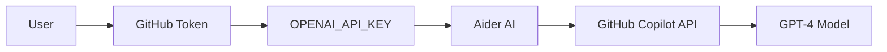

# Aider AI Integration Summary

## Overview

This document summarizes the Aider AI integration into the morpheus-aruba-tasks project.

## Changes Made

### 1. DevContainer Configuration (`devcontainer.json`)

**Added:**

- **Environment Variables:**
  - `OPENAI_API_BASE=https://api.githubcopilot.com`
  - `OPENAI_API_KEY=${GITHUB_TOKEN}`
  - `AIDER_MODEL=gpt-4`
  - `AIDER_AUTO_COMMITS=false`
  - `AIDER_DARK_MODE=true`

- **Python Feature:**
  - Added Python 3.11 with tools and optimization via devcontainer features

### 2. Post-Create Script (`post-create.sh`)

**Added:**

- Automatic Aider installation via `pip3 install aider-install`
- Version validation for Aider
- Environment variable validation (OPENAI_API_BASE, OPENAI_API_KEY, AIDER_MODEL)
- Integration check for GitHub Copilot configuration

### 3. New Files Created

#### `AIDER_SETUP.md`

Complete setup and usage guide including:

- Environment configuration
- GitHub token setup (3 methods)
- Basic and advanced usage examples
- Interactive commands reference
- Best practices
- Troubleshooting guide
- Project integration patterns

#### `AIDER_QUICKSTART.md`

Quick reference guide with:

- Basic commands
- Common use cases
- Quick examples
- Environment variables
- Validation steps

#### `validate-aider.sh`

Automated validation script that checks:

- Python and pip installation
- Aider installation and version
- Environment variables configuration
- GitHub CLI authentication
- API connectivity
- Provides troubleshooting guidance

#### `.aider.conf.yml`

Aider configuration file with:

- Model settings (gpt-4)
- API base URL configuration
- Git integration settings
- UI preferences (dark mode, streaming)
- File ignore patterns
- Auto-commit disabled for review workflow

### 4. Updated Files

#### `.gitignore`

**Added section:**

- Aider cache and history files
- GitHub Copilot artifacts
- AI assistant temporary files

#### `README.md`

**Added section:**

- AI-Assisted Development introduction
- Quick start commands
- Links to documentation

## How It Works

### Authentication Flow



### Workflow Integration

1. **DevContainer starts** → Installs Aider via post-create script
2. **Environment variables** → Set from containerEnv and local GITHUB_TOKEN
3. **Validation** → Run `validate-aider.sh` to check setup
4. **Usage** → Run `aider` with project context

## Usage Scenarios

### Scenario 1: Create New Script

```bash
aider AGENTS.md commons.sh

> Create a new script 'backup-aruba.sh' following project standards
```

### Scenario 2: Refactor Existing Code

```bash
aider aruba-auth.sh

> Refactor authentication logic to support MFA
```

### Scenario 3: Add Tests

```bash
aider create-vrf.sh tests/test_create-vrf.bats

> Add comprehensive BATS tests for all functions
```

## Configuration Details

### Environment Variables

| Variable | Value | Purpose |
|----------|-------|---------|
| `OPENAI_API_BASE` | `https://api.githubcopilot.com` | GitHub Copilot API endpoint |
| `OPENAI_API_KEY` | `${GITHUB_TOKEN}` | Authentication token |
| `AIDER_MODEL` | `gpt-4` | LLM model to use |
| `AIDER_AUTO_COMMITS` | `false` | Manual review before commits |
| `AIDER_DARK_MODE` | `true` | UI preference |

### File Ignore Patterns

Aider is configured to ignore:

- Log files (`*.log`, `logs/*`)
- Temporary files (`tmp/*`, `*.tmp`)
- Backup files (`backups/*`)
- Cache directories (`__pycache__`, `.pytest_cache`)
- Git internals (`.git/*`)
- DevContainer files (`.devcontainer/*`)

## Validation Checklist

Run `validate-aider.sh` to verify:

- ✅ Python 3.11+ installed
- ✅ pip3 available
- ✅ Aider installed and accessible
- ✅ Environment variables configured
- ✅ GitHub CLI authenticated
- ✅ API connectivity working

## Troubleshooting

### Common Issues

1. **"Authentication failed"**
   - Solution: `export OPENAI_API_KEY=$(gh auth token)`

2. **"Aider not found"**
   - Solution: `pip3 install aider-install`

3. **"GitHub CLI not authenticated"**
   - Solution: `gh auth login`

4. **Environment variables not set**
   - Check: DevContainer needs rebuild after modifying `devcontainer.json`

## Next Steps

### For Users

1. Rebuild DevContainer to apply changes
2. Run `./validate-aider.sh` to verify setup
3. Read `AIDER_SETUP.md` for complete documentation
4. Start using Aider: `aider AGENTS.md commons.sh`

### For Developers

1. Test Aider with existing scripts
2. Create new scripts using Aider assistance
3. Refactor code with AI guidance
4. Generate tests automatically
5. Follow project standards (AGENTS.md)

## Documentation Structure

```text
📁 morpheus-aruba-tasks/
├── 📄 AIDER_SETUP.md           # Complete guide
├── 📄 AIDER_QUICKSTART.md      # Quick reference
├── 📄 AIDER_INTEGRATION.md     # This file
├── 📄 AGENTS.md                # Project standards
├── 🔧 validate-aider.sh        # Validation script
├── ⚙️  .aider.conf.yml          # Aider configuration
└── 📁 .devcontainer/
    ├── 📄 devcontainer.json    # Updated with env vars
    └── 🔧 post-create.sh       # Updated with Aider install
```

## Benefits

### For Development

- ✅ AI-assisted code generation following project standards
- ✅ Automated refactoring with context awareness
- ✅ Test generation aligned with BATS patterns
- ✅ Code review and suggestions
- ✅ Documentation generation

### For Consistency

- ✅ Always references AGENTS.md for standards
- ✅ Uses commons.sh for logging patterns
- ✅ Follows shellcheck and markdownlint rules
- ✅ Maintains consistent coding style
- ✅ Generates proper commit messages

### For Productivity

- ✅ Faster script development
- ✅ Reduced boilerplate coding
- ✅ Automated test creation
- ✅ Interactive debugging assistance
- ✅ Context-aware suggestions

## Security Considerations

### Token Management

- **GITHUB_TOKEN** is sourced from local environment
- Never commit tokens to repository
- Token is only used for GitHub Copilot API
- Validate token expiration regularly

### API Usage

- All API calls go through GitHub Copilot endpoint
- No direct OpenAI API usage
- GitHub Copilot subscription required
- Rate limits apply per GitHub account

### Data Privacy

- Code context is sent to GitHub Copilot API
- Follow GitHub's Copilot privacy policy
- Avoid sending sensitive credentials in code
- Use `.aiderignore` for sensitive files

## Support and Resources

### Documentation

- **Aider Official**: <https://aider.chat/>
- **GitHub Copilot**: <https://docs.github.com/en/copilot>
- **Project Standards**: `AGENTS.md`
- **Testing Guide**: `TESTING.md`

### Internal Links

- [Quick Start](./AIDER_QUICKSTART.md)
- [Complete Setup](./AIDER_SETUP.md)
- [Project Standards](./AGENTS.md)
- [Contributing Guide](./CONTRIBUTING.md)

---

**Last Updated:** October 2025
**Status:** ✅ Implemented and Ready
