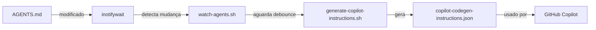

# AGENTS.md File Watcher

## 📖 Visão Geral

O **AGENTS.md File Watcher** é um sistema automatizado que monitora mudanças no arquivo `AGENTS.md` e regenera automaticamente o arquivo `copilot-codegen-instructions.json` sempre que o documento de referência para agentes for modificado.

## 🎯 Objetivo

Garantir que as instruções do GitHub Copilot estejam sempre sincronizadas com o documento `AGENTS.md`, eliminando a necessidade de executar manualmente o script de geração após cada edição.

## 🚀 Funcionamento

### Arquitetura



### Componentes

1. **watch-agents.sh**: Script principal de monitoramento
2. **inotifywait**: Ferramenta de monitoramento de eventos do filesystem
3. **generate-copilot-instructions.sh**: Script que processa o AGENTS.md
4. **Debounce**: Mecanismo de espera para evitar execuções múltiplas

### Eventos Monitorados

O watcher reage aos seguintes eventos no arquivo `AGENTS.md`:

- `modify`: Quando o arquivo é modificado
- `close_write`: Quando o arquivo é salvo (fechado após escrita)

## 📦 Instalação Automática

O watcher é configurado **automaticamente** quando o devcontainer é criado:

1. O `post-create.sh` instala `inotify-tools`
2. O `post-create.sh` inicia o `watch-agents.sh` em background
3. O watcher fica rodando silenciosamente monitorando mudanças

### Verificar se Está Rodando

```bash
./watch-agents.sh --status
```

**Saída esperada:**

```text
━━━━━━━━━━━━━━━━━━━━━━━━━━━━━━━━━━━━━━━━━━━━━━━━━━━━━━━━
📊 Status do AGENTS.md Watcher
━━━━━━━━━━━━━━━━━━━━━━━━━━━━━━━━━━━━━━━━━━━━━━━━━━━━━━━━
Status: ✅ Rodando
PID: 12345
Arquivo monitorado: AGENTS.md
Log: /workspaces/morpheus-aruba-tasks/logs/watch-agents.log
━━━━━━━━━━━━━━━━━━━━━━━━━━━━━━━━━━━━━━━━━━━━━━━━━━━━━━━━
```

## 🎮 Comandos

### Iniciar Manualmente

Se o watcher não estiver rodando:

```bash
# Em foreground (vê logs em tempo real)
./watch-agents.sh

# Em background (roda silenciosamente)
./watch-agents.sh --background
```

### Parar

```bash
./watch-agents.sh --stop
```

### Ver Status

```bash
./watch-agents.sh --status
```

### Ver Logs

```bash
tail -f logs/watch-agents.log
```

### Ajuda

```bash
./watch-agents.sh --help
```

## ⚙️ Configuração

### Variáveis de Ambiente

#### `WATCH_AGENTS_DEBOUNCE`

Tempo de espera (em segundos) após detectar uma mudança antes de executar o script gerador.

**Padrão:** `2` segundos

**Uso:**

```bash
# Debounce de 5 segundos
export WATCH_AGENTS_DEBOUNCE=5
./watch-agents.sh --background
```

**Por que debounce?**

Evita múltiplas execuções quando você está editando o arquivo rapidamente (salvando várias vezes em sequência).

## 📊 Logs

### Localização

- **Arquivo de log:** `logs/watch-agents.log`
- **PID file:** `/tmp/watch-agents.pid`

### Visualizar Logs em Tempo Real

```bash
tail -f logs/watch-agents.log
```

### Exemplo de Log

```log
[2025-10-12 14:30:15] [INFO] [watch_agents] Iniciando monitoramento de AGENTS.md
[2025-10-12 14:30:15] [INFO] [watch_agents] Diretório: /workspaces/morpheus-aruba-tasks
[2025-10-12 14:30:15] [INFO] [watch_agents] Eventos monitorados: modify, close_write
[2025-10-12 14:30:15] [SUCCESS] [watch_agents] Monitoramento ativo! Aguardando mudanças...
[2025-10-12 14:35:22] [INFO] [watch_agents] Arquivo modificado detectado: AGENTS.md
[2025-10-12 14:35:22] [INFO] [watch_agents] Aguardando 2s para estabilizar...
[2025-10-12 14:35:24] [INFO] [watch_agents] Executando generate-copilot-instructions.sh...
[2025-10-12 14:35:35] [SUCCESS] [watch_agents] Instruções do Copilot regeneradas com sucesso!
```

## 🔧 Troubleshooting

### Watcher não está rodando

**Verificar:**

```bash
./watch-agents.sh --status
```

**Solução:**

```bash
./watch-agents.sh --background
```

### inotify-tools não instalado

**Erro:**

```text
❌ inotifywait não encontrado. Instale com: sudo apt-get install inotify-tools
```

**Solução:**

```bash
sudo apt-get update
sudo apt-get install inotify-tools
```

### Múltiplas instâncias rodando

**Sintoma:** Arquivo `copilot-codegen-instructions.json` é gerado múltiplas vezes.

**Solução:**

```bash
# Parar todos
./watch-agents.sh --stop

# Iniciar apenas um
./watch-agents.sh --background
```

### Script gerador falhando

**Verificar logs:**

```bash
tail -n 50 logs/watch-agents.log
```

**Testar manualmente:**

```bash
./generate-copilot-instructions.sh
```

## 🧪 Testando

### Teste Manual

1. Certifique-se de que o watcher está rodando:

   ```bash
   ./watch-agents.sh --status
   ```

2. Edite o arquivo `AGENTS.md`:

   ```bash
   echo "# Teste" >> AGENTS.md
   ```

3. Salve o arquivo

4. Aguarde ~2 segundos

5. Verifique se `copilot-codegen-instructions.json` foi atualizado:

   ```bash
   ls -lh copilot-codegen-instructions.json
   ```

6. Verifique os logs:

   ```bash
   tail -n 20 logs/watch-agents.log
   ```

### Teste de Performance

```bash
# Ver quantas vezes o script foi executado
grep "Instruções do Copilot regeneradas" logs/watch-agents.log | wc -l
```

## 📝 Workflow Típico

1. **Desenvolvedor edita `AGENTS.md`**
   - Adiciona novos padrões
   - Atualiza exemplos
   - Corrige documentação

2. **Desenvolvedor salva o arquivo** (Ctrl+S)

3. **Watcher detecta a mudança** (instantâneo)

4. **Aguarda debounce** (2 segundos padrão)

5. **Executa `generate-copilot-instructions.sh`** automaticamente
   - Traduz conteúdo
   - Gera JSON
   - Atualiza timestamp

6. **GitHub Copilot usa nova versão** automaticamente
   - Sem necessidade de restart do VS Code
   - Instruções atualizadas imediatamente

## 🎯 Benefícios

✅ **Automatização Total**: Nunca esqueça de regenerar as instruções
✅ **Feedback Imediato**: Veja mudanças refletidas em segundos
✅ **Zero Intervenção**: Funciona silenciosamente em background
✅ **Logs Detalhados**: Auditoria completa de todas as regenerações
✅ **Integração Perfeita**: Configurado automaticamente no devcontainer
✅ **Debounce Inteligente**: Evita execuções desnecessárias

## 🔄 Integração com Devcontainer

### Fluxo de Inicialização

1. **Container é criado**
2. `post-create.sh` é executado
3. `inotify-tools` é instalado
4. `watch-agents.sh` é iniciado em background
5. Watcher fica monitorando `AGENTS.md`

### Personalização

Se você quiser **desabilitar** o watcher automático:

Edite `.devcontainer/post-create.sh` e comente a seção:

```bash
# # Iniciar watcher do AGENTS.md em background
# if [[ -f "watch-agents.sh" ]]; then
#   ./watch-agents.sh --background
# fi
```

## 📚 Referências

- **Script Principal:** `watch-agents.sh`
- **Script Gerador:** `generate-copilot-instructions.sh`
- **Configuração DevContainer:** `.devcontainer/post-create.sh`
- **Documentação AGENTS:** `AGENTS.md`
- **Ferramenta de Monitoramento:** [inotify-tools](https://github.com/inotify-tools/inotify-tools)

## 🤝 Contribuindo

Para melhorar o watcher:

1. Edite `watch-agents.sh`
2. Teste localmente
3. Verifique com shellcheck: `shellcheck watch-agents.sh`
4. Execute testes BATS (se aplicável)
5. Submeta PR com descrição detalhada

---

**Última Atualização:** 2025-10-12
**Versão:** 1.0.0
**Autor:** DevOps Vanilla Team
