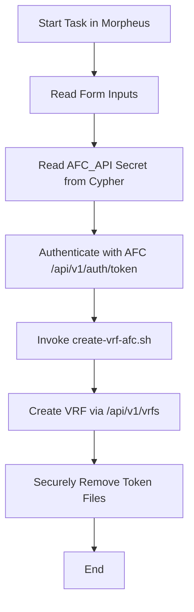

# wrapper-create-vrf-afc.sh

Quick guide for the VRF creation wrapper in HPE Aruba Fabric Composer (AFC) integrated with Morpheus Data.

## Overview

The `wrapper-create-vrf-afc.sh` script is a wrapper designed to be used as a Task in Morpheus Data. It:

- Reads form parameters via Groovy Template Syntax (customOptions.*)
- Retrieves AFC credentials from Cypher (secret `AFC_API`)
- Authenticates with AFC (generates temporary token)
- Invokes the main script `create-vrf-afc.sh` with the correct arguments
- Securely removes token files at the end of execution (trap with shred when available)

## Supported Inputs (via customOptions)

Define the following fields in Morpheus Form/Options (names must match exactly):

Required:

- `ARUBA_VRF_NAME` — VRF name (e.g.: PROD-VRF)
- `ARUBA_FABRIC` — Fabric name in AFC (e.g.: dc1-fabric)

Optional:

- `ARUBA_RD` — Route Distinguisher (e.g.: 65000:100)
- `ARUBA_RT_IMPORT` — Route Target Import (e.g.: `65000:100,65000:200`)
- `ARUBA_RT_EXPORT` — Route Target Export (e.g.: `65000:100,65000:200`)
- `ARUBA_AF` — Address Family (e.g.: `ipv4`, `ipv6` or `ipv4,ipv6`)
- `ARUBA_AF` — Address Family (e.g.: `ipv4`, `ipv6` or `evpn`; default: `ipv4`)
- `ARUBA_VNI` — L2/L3 VPN VNI (1-16777214)
- `ARUBA_SWITCHES` — Comma-separated switch UUIDs (optional)
- `ARUBA_DESCRIPTION` — VRF description
- `DRY_RUN` — `true`/`false` to validate without creating/applying

In the script body, these values are referenced as:

```bash
ARUBA_VRF_NAME="<%=customOptions.ARUBA_VRF_NAME%>"
ARUBA_FABRIC="<%=customOptions.ARUBA_FABRIC%>"
ARUBA_RD="<%=customOptions.ARUBA_RD%>"
ARUBA_RT_IMPORT="<%=customOptions.ARUBA_RT_IMPORT%>"
ARUBA_RT_EXPORT="<%=customOptions.ARUBA_RT_EXPORT%>"
ARUBA_AF="<%=customOptions.ARUBA_AF%>"
ARUBA_DESCRIPTION="<%=customOptions.ARUBA_DESCRIPTION%>"
MORPHEUS_DRY_RUN="<%=customOptions.DRY_RUN%>"
```

## Credentials via Cypher

Create a secret in Morpheus Cypher named `AFC_API` containing JSON in the format:

```json
{
  "username": "<USER>",
  "password": "<PASSWORD>",
  "URL": "https://<AFC URL>/"
}
```

The wrapper reads this value with:

```bash
AFC_API_JSON="<%=cypher.read('AFC_API')%>"
```

Then, it extracts `username`, `password`, and `URL`, parsing protocol, host, and port to export the variables expected by the main script (`FABRIC_COMPOSER_USERNAME`, `FABRIC_COMPOSER_PASSWORD`, `FABRIC_COMPOSER_IP`, `FABRIC_COMPOSER_PORT`, `FABRIC_COMPOSER_PROTOCOL`).

## Execution Flow

1. Validates dependencies (`curl`, `jq`, `sed`; `shred` optional)
2. Validates required inputs (`ARUBA_VRF_NAME`, `ARUBA_FABRIC`)
3. Reads and validates the `AFC_API` secret from Cypher
4. Authenticates with AFC (`/api/v1/auth/token`) and saves token temporarily
5. Invokes `create-vrf-afc.sh` with mapped arguments
6. Securely cleans up token files at the end (trap)

Temporary token files (in the same directory as the wrapper):

- `.afc_token`
- `.afc_token_expiry`

These files are always removed at the end (EXIT/INT/TERM), using `shred` when available.

## Requirements to Run in Morpheus (Task)

- Task Type: Shell (Bash)
- Content: the `wrapper-create-vrf-afc.sh` file (or reference it from the repository)
- Form/Options: define the fields described in “Supported Inputs”
- Cypher: existing and accessible `AFC_API` secret
- Permissions: Task/User must have access to Cypher `AFC_API`
- Execution environment must have dependencies:
  - `bash`, `curl`, `jq`, `sed`
  - `shred` (optional, for secure token cleanup)

## Example Usage (Morpheus)

- Create/edit a Form/Option Type with the fields:
  - `ARUBA_VRF_NAME` (text, required)
  - `ARUBA_FABRIC` (text, required)
  - `ARUBA_RD` (text, optional)
  - `ARUBA_RT_IMPORT` (text, optional)
  - `ARUBA_RT_EXPORT` (text, optional)
  - `ARUBA_AF` (select: `ipv4`, `ipv6`, `evpn`, optional; default: `ipv4`)
  - `ARUBA_VNI` (text, optional)
  - `ARUBA_SWITCHES` (text, optional)
  - `ARUBA_DESCRIPTION` (text, optional)
  - `DRY_RUN` (boolean, optional)
- Ensure Cypher `AFC_API` is set as per the JSON above
- Associate this Form with the Task containing the wrapper script
- Run the Task passing the desired values

## Troubleshooting

- 401/403: check `username/password` and AFC permissions; verify the secret `URL`
- Certificates: if AFC uses an untrusted certificate, the wrapper uses `--insecure` in `curl`
- `DRY_RUN=true`: the wrapper validates, but `create-vrf-afc.sh` does not apply changes

## APIs Used

- `POST /api/v1/auth/token` — AFC authentication, returns a token
- `GET /api/v1/fabrics` — List fabrics (used by main script)
- `POST /api/v1/vrfs` — Create VRF (used by main script)
- Morpheus Cypher API — Secret retrieval (`cypher.read('AFC_API')`)

## Workflow Diagram



## References

- AFC API Getting Started: <https://developer.arubanetworks.com/afc/docs/getting-started-with-the-afc-api>
- VRF (AFC Online Help): <https://arubanetworking.hpe.com/techdocs/AFC/700/Content/afc70olh/add-vrf.htm>
- Authentication API: <https://developer.arubanetworks.com/afc/reference/getapikey-1>
- Ansible (AFC implementation reference): <https://github.com/aruba/hpeanfc-ansible-collection>
- Morpheus Data — Cypher (docs): <https://docs.morpheusdata.com/>
- Morpheus Data — Groovy Template Syntax (docs): <https://docs.morpheusdata.com/>
